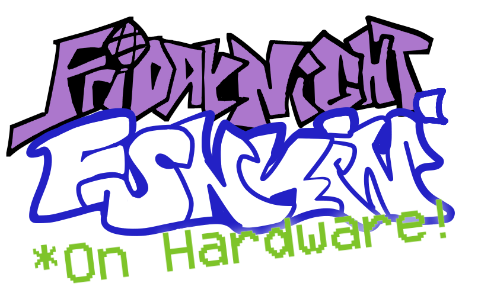

  

# About
[Demo](https://www.youtube.com/watch?v=g3J5mf7iiGk)
Friday Night Hardware is a recreation of one of the levels from the browser / standalone game "Friday Night Funkin'". This was my final project for an Introduction to Embedded Systems course, taken in Spring 2021.
